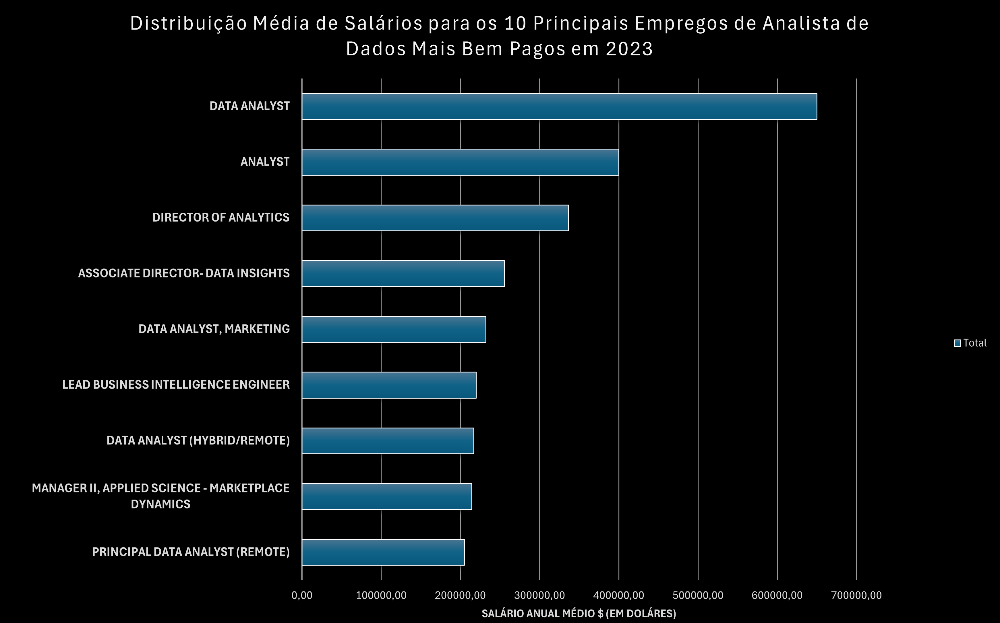
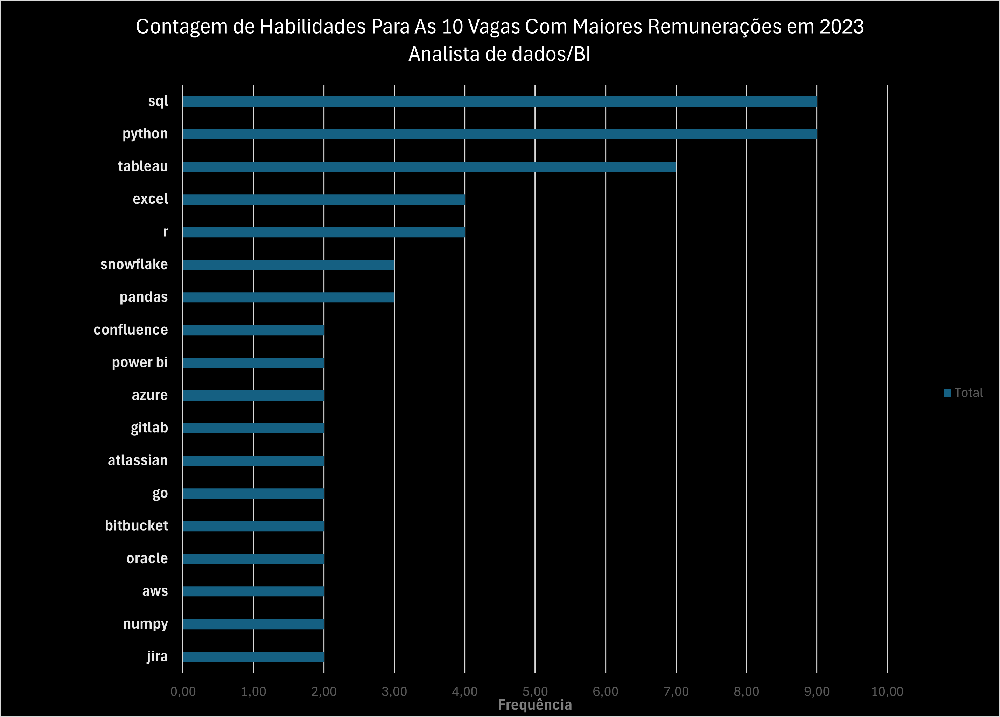

# Introdução
Explore o mercado de trabalho de dados! Este projeto se concentra em vagas de analista de dados e analista de BI, explorando os empregos mais bem remunerados, habilidades em alta demanda e onde a alta demanda se encontra com salários elevados nessas duas áreas.

Avalie as queries SQL aqui: [project_sql folder](/project_sql/).

# Background
### As perguntas que eu queria responder por meio das minhas queries SQL eram:

1. Quais são as vagas com os maiores salários para as funções de analista de dados e analista de BI?
2. Quais habilidades são necessárias para essas vagas mais bem remuneradas?
3. Quais habilidades possuem a maior demanda para as funções de analista de dados e analista de BI?
4. Quais habilidades estão associadas a um nível maior de salário médio?
5. Quais são as habilidades mais recomendadas para aprimorar?

# Ferramentas utilizadas

- **SQL**: A base da minha análise, permitiu que eu consultasse o banco de dados e descobrisse insights críticos.
- **PostgreSQL**: O sistema de gerenciamento de banco de dados escolhido, ideal para lidar com a base de dados utilizada nesse projeto.
- **Visual Studio Code**: Minha ferramenta padrão para gerenciamento de banco de dados e execução de consultas SQL.
- **Git & GitHub**: Essenciais para controle de versão e compartilhamento dos meus scripts e análises SQL, garantindo colaboração e rastreamento de projetos.

# A Análise
Cada query nesse projeto visava investigar aspectos específicos do mercado de trabalho para analistas de dados e de BI. Eu abordei cada pergunta da seguinte forma:

### 1. Vagas com maior remuneração para as funções de analista de dados e de BI
Para identificar os cargos mais bem remunerados, filtrei as posições de analista de dados e analista de BI pelo salário médio anual e localização, com foco em empregos remotos. Essa query destaca as oportunidades com alta remuneração na área.

```sql
SELECT
    job_id,
    job_title,
    job_location,
    job_schedule_type,
    salary_year_avg,
    job_posted_date,
    name AS company_name
FROM
    job_postings_fact
LEFT JOIN company_dim ON job_postings_fact.company_id = company_dim.company_id
WHERE
    job_location = 'Anywhere'
    AND salary_year_avg IS NOT NULL
    AND (job_title_short = 'Data Analyst'
    OR job_title_short = 'Business Analyst')
ORDER BY
    salary_year_avg DESC
LIMIT 10;
```
Um resumo sobre as vagas que possuem as maiores remunerações para analistas de dados e de BI:

**Amplitude salarial**: As 10 vagas com as maiores remunerações possuem um salário anual que varia entre $200000 e $650000 (valores em dólares americanos).

**Empregadores**: Empresas como a Meta, AT&T, Uber e Pinterest estão entre as que oferecem os maiores salários, o que demonstra uma demanda que se estende por diversos setores.

**Variedade de títulos de emprego**: Existe uma grande diversidade entre os títulos de emprego, dentre os quais: Diretor de análises, Engenheiro Líder de BI, Analista de Dados, Diretor Associado de Insights de Dados. Isso reflete uma grande variedade de funções e especializações na área de análise de dados e de BI.



*Gráfico de barras com visualização dos 10 maiores salários para analistas de dados e de BI.*

### 2. Habilidades demandadas para as vagas com maior remuneração
Para entender quais habilidades são necessárias para as vagas com as maiores remunerações, realizei um join entre os dados de postagens de vagas e de habilidades, gerando insights sobre o que os empregadores valorizam para funções com alta compensação.

```sql
WITH top_salario_vagas AS (
    SELECT
        job_id AS id_vaga,
        job_title AS titulo_vaga,
        salary_year_avg AS salario_anual,
        name AS empresa
    FROM
        job_postings_fact
    LEFT JOIN company_dim ON job_postings_fact.company_id = company_dim.company_id
    WHERE
        job_location = 'Anywhere'
        AND salary_year_avg IS NOT NULL
        AND (job_title_short = 'Data Analyst'
        OR job_title_short = 'Business Analyst')
    ORDER BY
        salary_year_avg DESC
    LIMIT 14
)

SELECT
    top_salario_vagas.*,
    skills_dim.skills AS habilidades
FROM top_salario_vagas
INNER JOIN skills_job_dim ON top_salario_vagas.id_vaga = skills_job_dim.job_id
INNER JOIN skills_dim ON skills_job_dim.skill_id = skills_dim.skill_id
ORDER BY
    salario_anual DESC;
```
Informações levantadas sobre as habilidades demandadas para as 10 vagas com maior remuneração para analistas de dados e de BI em 2023 (a query possui um limite de 14 resultados por conta de como a base de dados utilizada para a análise funciona, algumas das vagas não possuíam informação sobre as habilidades demandadas e portanto foram desconsideradas):

- **SQL** e **Python** lideram o ranking com uma contagem de 9 vagas.
- **Tableau** aparece como requisito em 7 das vagas.
- **Excel** e **R** são demandados em 5 das vagas analisadas.



### 3. Habilidades mais demandadas para analistas de dados e de BI
Essa query ajudou a identificar quais são as habilidades mais frequentemente requisitadas nas vagas analisadas, direcionando o foco para áreas com alta demanda.

```sql
SELECT
    skills AS habilidades,
    COUNT(skills_job_dim.job_id) AS demanda_total
FROM
    job_postings_fact
INNER JOIN skills_job_dim ON job_postings_fact.job_id = skills_job_dim.job_id
INNER JOIN skills_dim ON skills_job_dim.skill_id = skills_dim.skill_id
WHERE
    job_title_short = 'Data Analyst'
    OR job_title_short = 'Business Analyst'
GROUP BY
    skills
ORDER BY
    demanda_total DESC
LIMIT 5;
```
Aqui estão as habilidades mais demandadas para analistas de dados ou de BI em 2023
- **SQL** e **Excel** permanecem fundamentais, enfatizando a necessidade de fortes habilidades básicas em processamento de dados e manipulação de planilhas.
- **Programação** e **Ferramentas de Visualização** como **Python**, **Tableau** e **Power BI** são essenciais, apontando para a crescente importância das habilidades técnicas na narrativa de dados e suporte à decisão.


| Habilidades | Demanda Total |
|-------------|---------------|
| SQL         | 110000        |
| Excel       | 84165         |
| Python      | 65423         |
| Tableau     | 55878         |
| Power BI    | 48719         |

*Tabela com as 5 habilidades mais demandadas para vagas de analistas de dados ou de BI*

### 4. Habilidades baseadas em salário médio
Explorar a média dos salários associados a diferentes habilidades revelou quais delas possuem as maiores remunerações.

```sql
SELECT
    skills AS habilidades,
    ROUND(AVG(salary_year_avg), 2) AS salario_medio
FROM
    job_postings_fact
INNER JOIN skills_job_dim ON job_postings_fact.job_id = skills_job_dim.job_id
INNER JOIN skills_dim ON skills_job_dim.skill_id = skills_dim.skill_id
WHERE
    salary_year_avg IS NOT NULL
    AND (job_title_short = 'Data Analyst'
    OR job_title_short = 'Business Analyst')
GROUP BY
    skills
ORDER BY
    salario_medio DESC
LIMIT 25;
```
A partir dessa query, consegui identificar os seguintes pontos:

- **Alta demanda por habilidades em Big Data e Machine Learning:** 
Os maiores salários são direcionados a analistas que possuem habilidades em tecnologia de big data, ferramentas de machine learning e bibliotecas de Python, refletindo a alta valorização do mercado por capacidades de processamento de dados e modelagem preditiva.

- **Proficiência em desenvolvimento e implantação de software:** 
A demanda por ferramentas de desenvolvimento e implantação indica que a intersecção entre análise de dados e engenharia tem sido valorizada, remunerando habilidades que facilitem a automação e a gestão eficiente de pipelines.

- **Expertise em computação em nuvem:** 
A demanda por profissionais com habilidades em computação em nuvem e engenharia de dados destaca um aumento de importância de ambientes analíticos baseados em nuvem, indicando que dominar habilidades em nuvem aumenta significativamente o potencial de ganhos na área.

| Habilidades | Salário Médio (USD) |
|-------------|----------------------|
| SVN         | 246,585.50           |
| Solidity    | 179,000.00           |
| Couchbase   | 160,515.00           |
| DataRobot   | 155,485.50           |
| Golang      | 155,000.00           |
| dplyr       | 147,633.33           |
| VMware      | 147,500.00           |
| Twilio      | 138,500.00           |
| MXNet       | 136,000.00           |
| Puppet      | 129,820.00           |

*Tabela de salário médio por habilidade de análise de dados ou de BI*

### 5. Habilidades mais vantajosas para se aprender
Combinando insights dos dados de demanda e salário, essa query tem como objetivo destacar as habilidades que possuem alta demanda e alta remuneração, oferecendo um foco estratégico para o desenvolvimento de habilidades da área.

```sql
SELECT
    skills_dim.skill_id AS habilidade_id,
    skills_dim.skills AS habilidades,
    COUNT(skills_job_dim.job_id) AS demanda_total,
    ROUND(AVG(job_postings_fact.salary_year_avg), 0) AS salario_medio
FROM job_postings_fact
INNER JOIN skills_job_dim ON job_postings_fact.job_id = skills_job_dim.job_id
INNER JOIN skills_dim ON skills_job_dim.skill_id = skills_dim.skill_id
WHERE
    salary_year_avg IS NOT NULL
    AND job_work_from_home = TRUE
    AND (job_title_short = 'Data Analyst'
    OR job_title_short = 'Business Analyst')
GROUP BY
    skills_dim.skill_id
HAVING
    COUNT(skills_job_dim.job_id) > 10
ORDER BY
    salario_medio DESC,
    demanda_total DESC
LIMIT 25;
```

| ID Habilidade | Habilidades | Demanda Total | Salário Médio ($) |
|---------------|-------------|---------------|-------------------|
| 75            | databricks  | 11            | $139,006          |
| 80            | snowflake   | 38            | $112,989          |
| 97            | hadoop      | 25            | $111,849          |
| 8             | go          | 30            | $111,121          |
| 77            | bigquery    | 16            | $110,813          |
| 74            | azure       | 35            | $110,804          |
| 234           | confluence  | 14            | $108,415          |
| 76            | aws         | 32            | $108,317          |
| 194           | ssis        | 12            | $106,683          |
| 185           | looker      | 54            | $106,259          |

*Lista das habilidades mais vantajosas para analistas de dados ou de BI classificadas por remuneração*

Resumo de habilidades que foram mais vantajosas para se especializar em 2023:

- **Linguagens de programação em alta demanda:** Python e R se destacam por sua alta demanda, com contagens de demanda de 256 e 156 respectivamente. Apesar de sua alta demanda, os salários médios estão em torno de $102,578 para Python e $101,223 para R, indicando que a proficiência nessas linguagens é altamente valorizada, mas também amplamente disponível.

- **Ferramentas e tecnologias de nuvem:** Habilidades em tecnologias especializadas como Snowflake, Azure, AWS e BigQuery mostram uma demanda significativa com salários médios relativamente altos, apontando para a crescente importância das plataformas de nuvem e tecnologias de big data na análise de dados.

- **Ferramentas de inteligência de negócios e visualização:** Tableau e Looker, com contagens de demanda de 257 e 54 respectivamente, e salários médios em torno de $99,807 e $106,259, destacam o papel crítico da visualização de dados e da inteligência de negócios na obtenção de insights acionáveis a partir dos dados.

- **Tecnologias de banco de dados:** A demanda por habilidades em bancos de dados tradicionais e NoSQL (Oracle, SQL Server, NoSQL) com salários médios variando de $99,993 a $103,877, reflete a necessidade duradoura de expertise em armazenamento, recuperação e gerenciamento de dados.

# O que aprendi
Através deste projeto, eu consegui acelerar o meu aprendizado em SQL, aplicando meus conhecimentos para criar algo útil para o meu momento atual.

- **Criação de queries complexas:** 
Consegui aplicar conceitos avançados de SQL ao realizar JOINs, utilizar WITHs para criação de result sets temporários, Subqueries, entre outros que foram necessários para finalização deste projeto.
- **Agregação de dados:** 
Precisei me habituar com o GROUP BY e funções agregadas como COUNT() e AVG() para criar sumarizações de dados.
- **Habilidade analítica**
Consegui colocar em prática minha habilidade analítica e de resolução de problemas para responder às perguntas do projeto através de queries que me levaram a ter insights valiosos.


# Conclusões

### Insights
Através das análises, diversos insights gerais surgiram:

1. **Vagas com maior remuneração para analistas de dados ou de BI**:
As vagas com maior remuneração para os analistas de dados ou de BI que permitem trabalho remoto possuem um grande alcance salarial, tendo como maior remuneração $650,000 anuais!
2. **Habilidades para as vagas com maior remuneração**: 
Vagas que possuem uma alta remuneração demandam uma grande proeficiência em SQL, sugerindo que essa é uma habilidade crítica para se ter um alto salário.
3. **Habilidade Mais Demandada**: 
SQL é também a habilidade mais demandada do mercado, tornando-a essencial para aqueles que querem trabalhar nessa área.
4. **Habilidades com Maiores Salários**: 
Habilidades especializadas como SVN e Solidity, são associadas aos maiores níveis de salário, indicando um nicho altamente recompensador.
5. **Habilidades Vantajosas Para o Mercado**:
SQL lidera em demanda e oferece um alto salário médio, posicionando essa como uma das habilidades mais vantajosas para analistas de dados ou de BI para se aprender e maximizar seu valor de mercado.

### Considerações Finais

Esse projeto desenvolveu minhas habilidades em SQL e me forneceu insights valiosos sobre o mercado de trabalho de análise de dados e de BI. Os resultados dessa análise servem para guiar a priorização do desenvolvimento de habilidades. Aspirantes a analistas de dados e de BI podem se posicionar melhor em um mercado competitivo ao se focar em habilidades com alta demanda e alta remuneração. Essa exploração dos dados destaca a importância do aprendizado contínuo e da adaptação às tendências emergentes na área de análise de dados e de BI.
